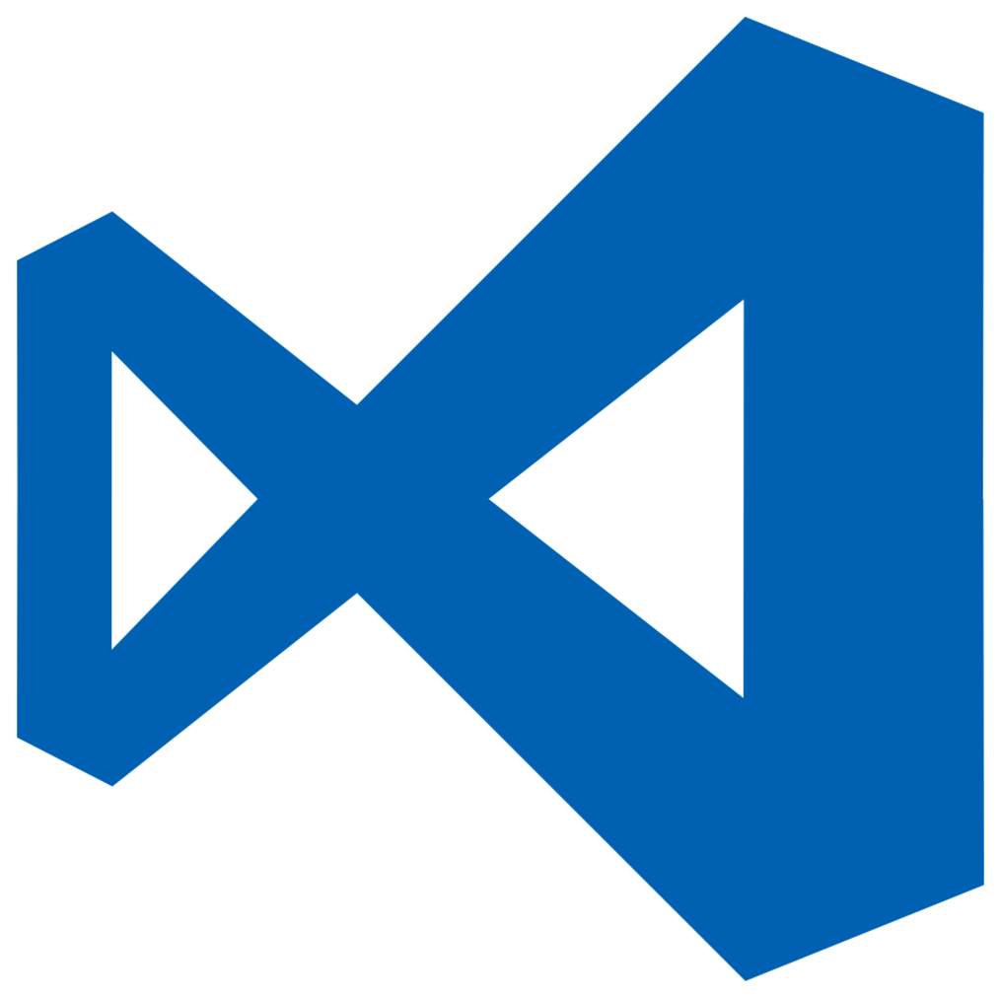

### Hi there 👋

<!--
**Mirai3103/Mirai3103** is a ✨ _special_ ✨ repository because its `README.md` (this file) appears on your GitHub profile.

Here are some ideas to get you started:

-->	

- 🌱 I’m currently learning at [SGU]
<!-- - 👯 I’m looking to collaborate on ... -->
<!-- - 🤔 I’m looking for help with ... -->
- 💬 Ask me about every thing
- 📫 How to reach me: [Facebook]
<!-- - 😄 Pronouns: ... -->
- ⚡ Fun fact: i'm a qbu.

### Tools:

 

### Programing languages

 

### Libraries and Frameworks:

 

## Databases:

 
 